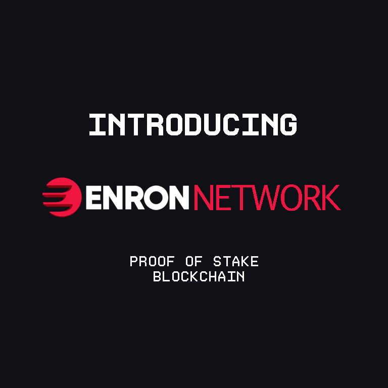

# 👋 Good day!

	
	

# 🔗 Join & Participate 

	<a href="https://t.me/enronnetwork" target="_blank">Let's build! — Enron Community</a>
	<a href="https://t.me/enronnetwork" target="_blank">

	
	

	</a>

<!--

	<a href="https://t.me/enronnetwork" target="_blank">Let's Stake! — Run your validator or participate</a>
	

-->

# 📊 Stats

<table style="height: 193px; width: 695px;">
	<tbody>
		<tr style="height: 125px;">
			<td style="width: 10px; height: 125px; text-align: center; vertical-align: middle;">
				
			</td>
			<td style="width: 28px; height: 118px; text-align: center; vertical-align: middle;" rowspan="2">
				
			</td>
		</tr>
		<tr style="height: 111px;">
			<td style="width: 10px; height: 111px; text-align: center; vertical-align: middle;">
				
			</td>
		</tr>
	</tbody>
</table>

# 🛠 Tools used

<a href="https://en.wikipedia.org/wiki/Android_(operating_system)" target="_blank" rel="noopener">
  </a> <a>  </a>    

